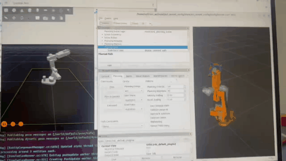
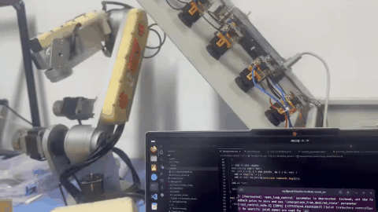
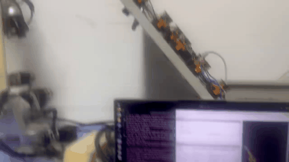

# AR3 ROS2 Intelligent Teleoperation Robotic Arm Control System

[](https://opensource.org/licenses/MIT)
[](https://docs.ros.org/en/jazzy/)

This project implements an intelligent control system for a 6-axis collaborative robotic arm based on **ROS 2 Jazzy** and **Teensy 4.1**, integrating **MoveIt 2** motion planning, the **ros2_control** hardware abstraction layer, and a **CAN bus force-controlled gripper**. Released under the MIT License, it aims to provide a reusable solution for low-cost, highly flexible robotic arm control.

> **Hardware Platform Note**: The mechanical structure of this project is based on the AR3 open-source 6-axis robotic arm. The ROS 2 control stack, Teensy 4.1 firmware, ros2_control hardware interface, CAN force-controlled gripper, and Gazebo simulation are all independently implemented.

---

## 📌 Key Features

- ✅ **Complete ROS 2 + MoveIt 2 Control Pipeline**: Closed-loop control from trajectory planning to motor pulse generation
- ✅ **High-Performance Teensy 4.1 Firmware**: Non-blocking trapezoidal acceleration/deceleration, multi-axis task queue, custom serial protocol (supporting `RJ`/`RP`/`HOME` commands)
- ✅ **ros2_control Hardware Interface Plugin**: Strict lifecycle management, providing precise joint state feedback and command dispatch (50 Hz)
- ✅ **CAN Bus Force-Controlled Gripper**: Teensy 4.1 + C610 + M2006, 1 kHz control loop, current ramp + speed PI (anti-windup) + stall-detection force control, with travel protection and CAN watchdog
- ✅ **Gazebo Simulation Support**: Complete simulation environment (with vision plugin and gripper model) for algorithm validation

---

## 🧱 System Architecture

| Layer | Component | Description |
|:---:|:---|:---|
| Planning | MoveIt 2 | Motion planning, obstacle avoidance, inverse kinematics |
| Control | `joint_trajectory_controller` | Trajectory tracking, interpolation, command dispatch |
| Driver | `AR3HardwareInterface` (ros2_control plugin) | Radian/step conversion, limit clipping, serial communication |
| Execution | Teensy 4.1 Firmware | Pulse generation, limit detection, safety interrupt, CAN gripper management |
| Simulation | Gazebo | Vision plugin, gripper model, algorithm validation |

---

## 🔧 Main Work

### 1. Complete ROS 2 + MoveIt 2 Control Pipeline

- Established the closed-loop control from **MoveIt 2 trajectory planning → ros2_control → hardware interface → motor pulse generation**
- Decoupled the planning layer from the execution layer, enabling real-time trajectory dispatch to the low-level firmware

### 2. High-Performance Teensy 4.1 Firmware

- Implemented a **non-blocking trapezoidal acceleration/deceleration** algorithm to ensure smooth multi-axis motion without blocking the main loop
- Designed a **multi-axis task queue** to support parallel motion scheduling of multiple joints
- Custom serial communication protocol supporting `RJ` (joint motion), `RP` (Cartesian pose), `HOME` (homing), and other commands

### 3. ros2_control Hardware Interface Plugin

- Strictly follows the ros2_control **lifecycle management** (configure → activate → deactivate → cleanup)
- Provides precise **joint state feedback** and **command dispatch**, with a stable control frequency of **50 Hz**

### 4. CAN Bus Force-Controlled Gripper Firmware

- Based on **Teensy 4.1 + C610 ESC + M2006 motor**, with a 1 kHz control loop
- Implemented **current ramp + speed PI (anti-windup)** to avoid current surges and integral windup
- **Stall-detection force control**: torque reaching 90% of threshold and output shaft speed < 5 rpm, sustained for 150 ms, determines grip completion
- Designed **output shaft travel accumulation protection** (including single-turn angle overflow handling) and a **CAN communication watchdog**
- Custom serial command protocol supporting online adjustment of force threshold, speed, travel, and other parameters

### 5. Gazebo Simulation Support

- Built a complete Gazebo simulation environment, including a **vision plugin** and **gripper model**
- Enables algorithm validation and testing of trajectory planning and control logic without physical hardware

---

## 📦 Package Description

| Package | Function |
|:---|:---|
| `ar3_description` | URDF/Xacro model description |
| `ar3_hardware_interface` | ros2_control hardware plugin, implementing `SystemInterface` |
| `teensy4.1` | Teensy 4.1 firmware (Arduino/PlatformIO platform) |
| `ar3_moveit_config` | MoveIt 2 configuration files |
| `ar3_gazebo` | Gazebo simulation |
| `ar3_bringup` | Launch files and trajectory examples |

---

## 🚀 Quick Start

### 1. Requirements

- **OS**: Ubuntu 24.04
- **ROS 2 Distribution**: Jazzy
- **Hardware**:
  - AR3 6-axis robotic arm (open-loop stepper motor version)
  - Teensy 4.1 development board
  - ASTRA PRO depth camera (or any ROS 2-supported RGB-D camera)
  - M2006 motor + C610 ESC (force-controlled gripper)

**Dependency Installation:**

```bash
sudo apt install ros-jazzy-ros2-control ros-jazzy-ros2-controllers ros-jazzy-moveit
sudo apt install ros-jazzy-gazebo-ros-pkgs ros-jazzy-tf2-tools
```

### 2. Build Workspace

```bash
mkdir -p ~/ar3_ws/src
cd ~/ar3_ws/src
git clone https://github.com/2694328475/ar3_ros2.git
cd ..
rosdep install --from-paths src --ignore-src -r -y
colcon build --symlink-install
source install/setup.bash
```

### 3. Flash Firmware

Open `teensy4.1/teensy4.1.ino` with Arduino IDE, select the **Teensy 4.1** board, compile and upload. Ensure the serial device is `/dev/ttyACM0`.
Or open 'Teensy_4.1_FreeRTOS' with PlatformIO.

### 4. Launch Real Robot Control

```bash
ros2 launch ar3_hd_moveit_config demo.launch.py
```

### 5. Gazebo Simulation Mode

```bash
ros2 launch ar3_gazebo ar3_gazebo_bringup.launch.py
ros2 launch ar3_moveit_config demo.launch.py use_sim_time:=true
```

### 6. Send Commands Directly via ros2_control

1. Edit `ar3_description/urdf/ar3.urdf.xacro` and uncomment the `ros2_control` configuration section
2. Launch trajectory control:

```bash
ros2 launch ar3_bringup ar3_trajectory.launch.py
```

---

## 📸 Demo

### Gazebo Simulation




### ros2_control and Limit Homing




### Real Robot Motion




---

## 📄 License

This project is licensed under the [MIT License](LICENSE).
